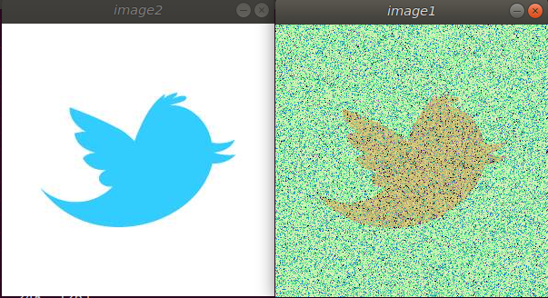
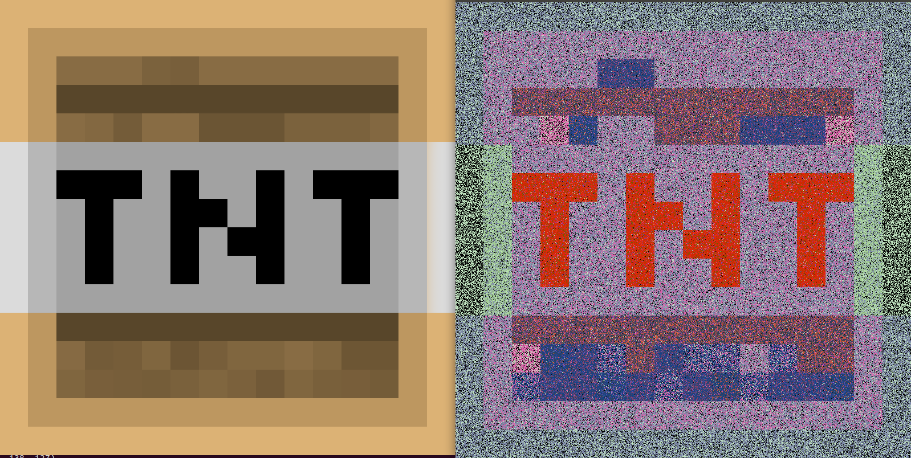
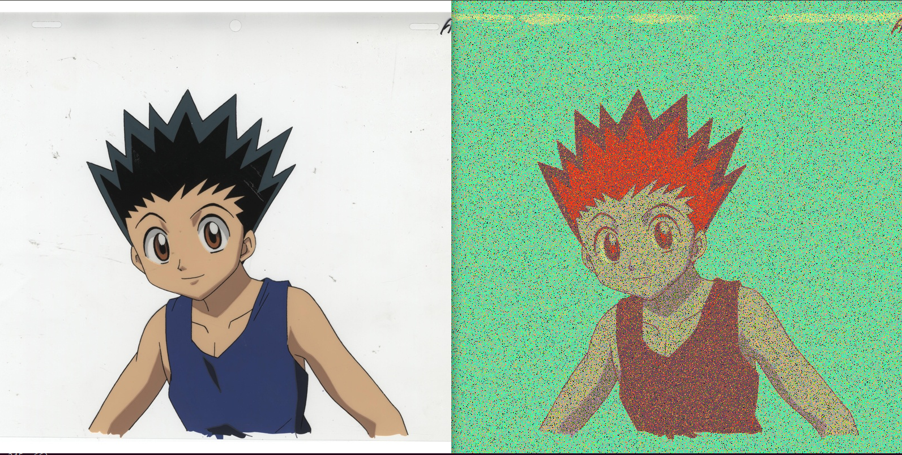
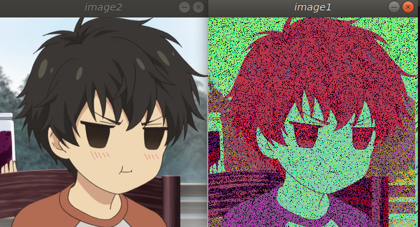

# pointillism-using-hexbot
As a part of noops challenge (https://github.com/noops-challenge) I made a python script to convert an image into art using pointillism.

## Original Image(Left) along with Converted image(Right) from script

